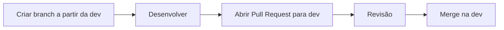

# Padrão de desenvolvimento

## Branches

* main: versão principal estável
* dev: desenvolvimento
* feature/*: nova funcionalidade
* fix/*: correção

---

## Fluxo



---

## Padrão de Commits

Para manter organização e rastreabilidade no projeto, todos os commits devem seguir o padrão abaixo:

### Estrutura

**Título (obrigatório):**

```
tipo: descrição curta da alteração
```

**Descrição (opcional):**

* Detalhes adicionais sobre a implementação

---

### Tipos de commit

| Tipo     | Uso                        |
| -------- | -------------------------- |
| feat     | Nova funcionalidade        |
| fix      | Correção de bug            |
| refactor | Melhoria interna de código |
| style    | Formatação/estilo          |
| docs     | Documentação               |
| chore    | Tarefas técnicas gerais    |

---

### Exemplos

```
feat: criar modelo Game
```

```
fix: corrigir busca de jogos
```

```
refactor: reorganizar estrutura do main.py
```

---

###
